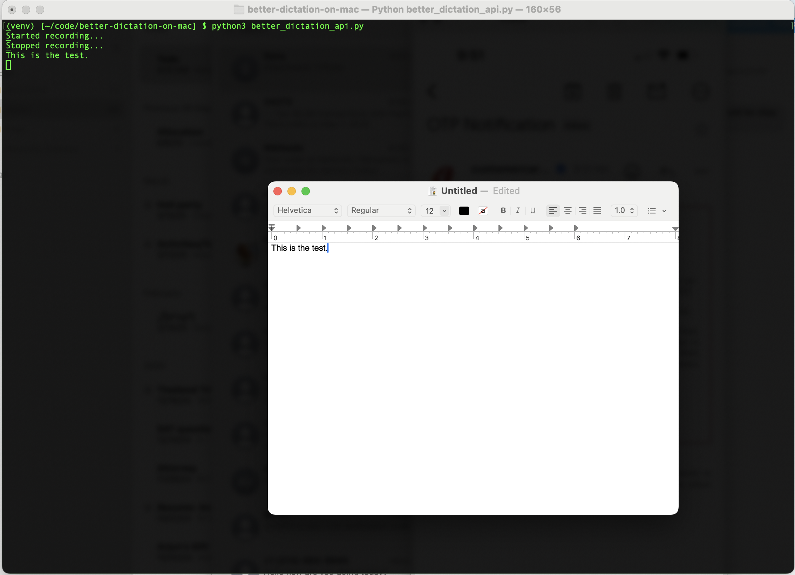

# Better Dictation for Mac



A replacement for macOS's built-in dictation feature that provides more accurate transcription using OpenAI's Whisper speech-to-text model. This is the same model that is used by OpenAI to transcribe voice inputs in the ChatGPT app.

## Features

- More accurate speech-to-text transcription compared to macOS's default dictation
- Uses the high-quality Whisper speech recognition model from OpenAI
- Seamlessly integrates with your Mac's keyboard shortcuts
- Real-time transcription with high accuracy

## Prerequisites

- Python 3.x
- OpenAI API key

## Usage

1. While you're in any app on your macbook (e.g. Chrome, TextEdit), press Command + Option + K to start dictation
2. Speak into your microphone, and then press Command + Option + K again
3. The transcribed text will be automatically typed where your cursor is located

## How it Works

This tool records audio when activated, sends it to OpenAI's Whisper API for transcription, and then types out the result as if it were typed from your keyboard. It provides a more accurate alternative to the built-in macOS dictation feature.

## Installation

1. Clone this repository:
   ```bash
   git clone https://github.com/<yourusername>/better-dictation-for-mac.git
   cd better-dictation-for-mac
   ```

2. Install the required Python dependencies:
   ```bash
   python3 -m venv venv
   source venv/bin/activate
   pip install -r requirements.txt
   ```

3. Create a `.env` file in the project root and add your OpenAI API key:
   ```
   OPENAI_API_KEY="your-api-key-here"
   ```

4. Run the script:
   ```bash
   python better_dictation_api.py
   ```

5. Keep the terminal window with the script running in the background. You can now switch to any other application window and use Command + Option + K to activate speech-to-text transcription while the script continues running.

## Requirements

The following Python packages are required:
- numpy
- sounddevice
- pynput
- pyautogui
- wavio
- openai
- python-dotenv

These will be automatically installed when you run `pip install -r requirements.txt`.